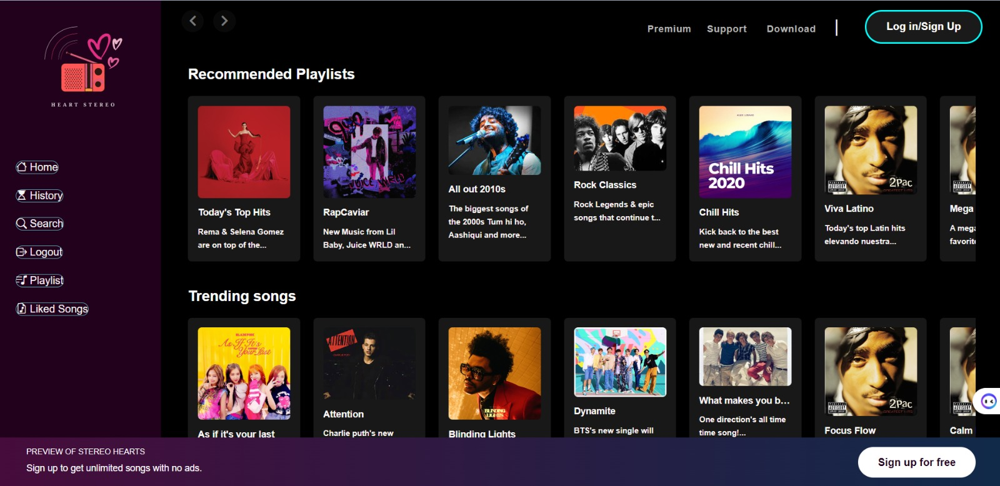

# HeartStereo - Your Ultimate Music Streaming Destination



HeartStereo is a robust music streaming application developed using NodeJS, EJS, and MySQL. It's designed to provide users with a seamless music streaming experience, offering features like user authentication, music library management, personalized playlists, liked songs list, and powerful search functionality.

## Features

- **User Authentication**: Secure user authentication system to protect user data and ensure privacy.
- **Music Library Management**: Efficient management of a vast music library, allowing users to explore a wide range of songs, albums, and artists.
- **Liked Songs List**: Users can easily access their favorite songs by adding them to their liked songs list.
- **Personalized Playlists**: Create custom playlists tailored to individual preferences, ensuring a personalized listening experience.
- **Seamless Streaming**: Smooth and uninterrupted streaming of music tracks, providing an immersive listening experience.
- **Powerful Search Functionality**: Robust search feature enables users to quickly find specific songs, albums, or artists within the music library.

## Technologies Used

- **NodeJS**: Server-side scripting language for building scalable and efficient web applications.
- **EJS**: Embedded JavaScript templating for generating dynamic HTML content.
- **MySQL**: Relational database management system used for storing and managing music data.
- **Express**: Web application framework for Node.js, providing a robust set of features for web and mobile applications.

## Installation

1. Clone the repository:

```bash
git clone https://github.com/your-username/HeartStereo.git
```

2. Install dependencies:

```bash
cd HeartStereo
npm install
```

3. Set up MySQL database:

- Create a MySQL database and import the provided schema file to set up the required tables.

4. Configure environment variables:

- Create a `.env` file in the root directory and configure environment variables such as database credentials and session secret.

5. Start the application:

```bash
npm start
```

6. Open your web browser and navigate to `http://localhost:3000` to access HeartStereo.

## Usage

1. Sign up for a new account or log in if you already have one.
2. Explore the music library to discover new songs, albums, and artists.
3. Add songs to your liked songs list to access them quickly.
4. Create personalized playlists based on your musical preferences.
5. Use the search functionality to find specific songs, albums, or artists.
6. Enjoy seamless music streaming wherever you go!

## Contributing

Contributions are welcome! If you'd like to contribute to HeartStereo, please follow these steps:

1. Fork the repository.
2. Create a new branch (`git checkout -b feature/improvement`).
3. Make your changes.
4. Commit your changes (`git commit -am 'Add new feature'`).
5. Push to the branch (`git push origin feature/improvement`).
6. Create a new Pull Request.
